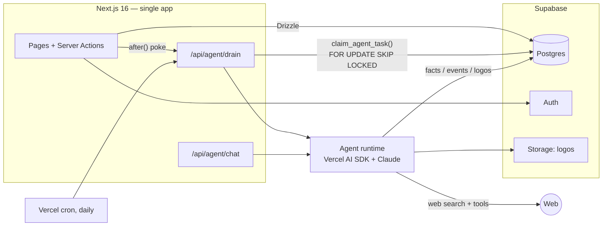

# Agentic CRM

An **agent-first CRM**, built as a portfolio project. Inspired by
[trycompai/crm](https://github.com/trycompai/crm) (MIT), rebuilt from scratch
with a deliberately simpler stack.

**Live demo:** https://agentic-crm-delta.vercel.app

The differentiator is not the CRUD — it's the **research agent with an
evidence ledger**: every fact the agent finds carries weighted evidence.
Strong primary evidence auto-applies to the record; weak evidence becomes a
suggestion a human reviews. **Nothing about a person is guessed.**

## How the evidence ledger works

The agent's `save_fact` tool reports *observations*, never confidence. The
ledger scores them:

| Evidence kind | Weight | Primary? |
|---|---|---|
| `profile.email-match` — profile tied to the contact's exact email | 0.95 | ✅ |
| `linkedin.employer-and-name` — LinkedIn matching name AND employer | 0.85 | ✅ |
| `crm.signature-block` — found in an email signature in the CRM | 0.80 | ✅ |
| `web.company-page` — employer's own site names the person | 0.70 | ✅ |
| `web.cited-claim` — third-party page makes the claim | 0.40 | — |
| `handle.name-form` — inference from a username | 0.35 | — |
| `contradiction` — conflicting information found | ×0.5 penalty | — |

Corroborating evidence compounds via **noisy-or** (`1 − Π(1 − wᵢ)`), each
contradiction halves the score, and the result maps to a band:
**verified ≥ 0.85 · probable ≥ 0.60 · possible < 0.60**.

A fact **auto-applies** only when it is *verified*, backed by at least one
*primary* source, has *zero contradictions*, **and the field is empty** — the
agent never overwrites what a human wrote. Everything else waits in the
Review queue with its full evidence trail.

In live testing: an ambiguous fictional contact produced **zero saved facts**
(the agent found several same-named people and declined to guess); a real
public figure produced three `verified`, source-cited facts that auto-applied.

## Architecture



- **Task queue in Postgres** — `agent_tasks` claimed by a SQL function with
  `FOR UPDATE SKIP LOCKED` + lease; two lanes (`visible` = no-LLM jobs like
  logo mirroring, `research` = LLM sessions); per-task budget, retries with
  backoff. No Redis, no external queue.
- **No per-minute cron** — Server Actions poke the drain with Next's
  `after()`, so research results land seconds after you click; a daily
  Vercel cron requeues stale leases as a backstop.
- **Native web search** — Anthropic's built-in web search tool via the
  Vercel AI SDK; zero extra search-API keys. The agent degrades gracefully
  when optional capabilities are missing.

## Stack

| Layer | Choice |
|---|---|
| App | Next.js 16 (App Router, Server Actions) — no separate backend |
| Database | Supabase Postgres + Drizzle ORM (checked-in SQL migrations) |
| Auth | Supabase Auth |
| Storage | Supabase Storage (mirrored company logos) |
| Agent | Vercel AI SDK (`ai` v7) + Anthropic Claude |
| UI | shadcn/ui (Base UI) + Tailwind v4, recharts, cmdk |
| Tooling | pnpm, Biome, Vitest, GitHub Actions |

## Getting started

1. Create a [Supabase](https://supabase.com) project; enable the **Email**
   provider (disable "Confirm email" for easy local demo).
2. `cp .env.example .env` and fill in the Supabase keys, `DATABASE_URL`
   (session pooler), `ANTHROPIC_API_KEY` and an `AGENT_DRAIN_SECRET`.
3. Install, migrate, run:

   ```sh
   pnpm install
   pnpm db:migrate
   pnpm dev
   ```

4. Sign up at http://localhost:3000, then `pnpm seed` for demo data.
5. Open a contact → **Research** → watch facts land with their evidence.

## Scripts

| Command | What it does |
|---|---|
| `pnpm dev` / `pnpm build` | dev server / production build |
| `pnpm lint` · `pnpm typecheck` · `pnpm test` | what CI runs |
| `pnpm db:generate --name x` / `pnpm db:migrate` | create / apply migrations |
| `pnpm seed` | deterministic demo data (log in once first) |

## Roadmap

- [x] Phase 0 — Scaffold, auth, workspace bootstrap, CI
- [x] Phase 1 — Core CRM: companies, contacts, deals kanban, activities timeline
- [x] Phase 2 — Research agent + evidence ledger + review UI + record chat
- [x] Phase 3 — Dashboards, ⌘K quick switcher, logo mirroring (visible lane)
- [x] Phase 4 — Multi-currency deals (frankfurter.app, lazily-cached daily rates, convert at aggregation time)
- [ ] Phase 5 — Gmail + Calendar sync

## License

MIT — and a thank-you to [trycompai/crm](https://github.com/trycompai/crm)
for the evidence-ledger concept this project reimplements from scratch.
